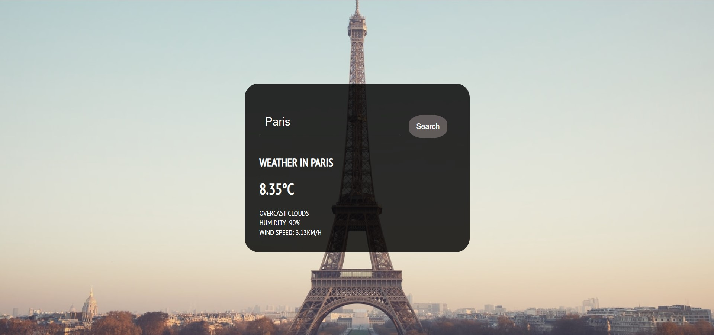

# WeatherApp

#### A Simple Weather-App that fetches weather and geolocation information of a city using <b>OpenWeatherMap API<b>.

#### 🔱 API Used: https://openweathermap.org/api
 
#### 💠 Click to view site: https://5andeepnambiar.github.io/WeatherApp/
  

